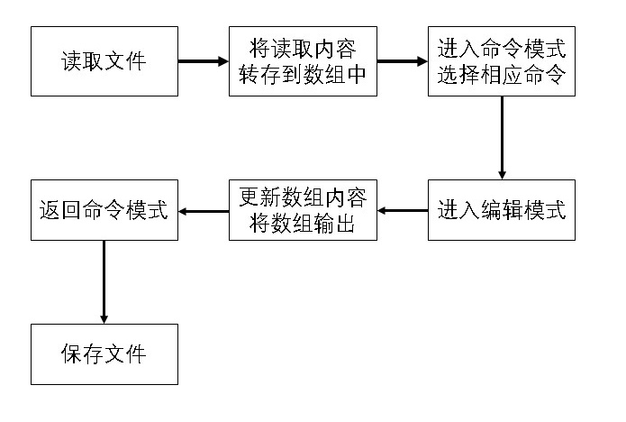

# 操作系统大作业报告
# Shell改进

## 选题
方案一：xv6操作系统Shell功能的新增与改进。

涉及的部分包括但不限于基础命令相关、文件管理、文档编辑。选此题的目的在于，扩充并完善xv6的基本功能，使得xv6能够更好地满足日常使用的需求。

## 团队管理

### 人员组成
* 陈曦 2016013275
* 吴海旭 2016013223
* 山本宇多子 2016080045
* 苏宇荣 2015080045

### 团队分工
* 陈曦：资料的搜集、实现多功能文本编辑器
* 吴海旭：资料的搜集、实现多功能文本编辑器
* 山本宇多子：资料的搜集、实现基础命令、文件管理相关、命令行计算器
* 苏宇荣：资料的搜集、实现基础命令、文件管理相关、命令行计算器

### 代码管理
使用git工具进行版本控制，并使用github作为远程库。 
仓库地址：https://github.com/wuhaixu2016/xv6_OS.git

## 开发环境
* 系统：Ubuntu 16.04 LTS + QEMU
* 编程语言：C

## 实现的功能
### 1. 基础命令
#### 1.1 支持自动补全
##### 使用方法
输入指令的至少两个字符后，输入*符号，即可代替后续的字符输入。如果查询到匹配的指令，则直接执行，没有则提示错误。

例如：
```
his* 等价于输入 history
fork* 等价于输入 forktest
ev* 1+2*3/4 等价于输入 eval 1+2*3/4
```

##### 实现详情
在console中，对输入的每条指令进行检测，如果输入指令中存在*符号，则触发自动补全。触发自动补全后，对系统中记录的所有指令进行匹配遍历，如果存在某个指令拥有完全匹配的前缀，则自动执行该指令。如果指令失配，则输出提示。

#### 1.2 支持自动修复命令

在使用命令行进行指令输入时，操作人员难免会出现typo。对于一些较长的复杂指令，重新输入是费时费力的。于是，我们开发了自动修复命令的程序，当系统侦测到可能的typo时，会提示并询问用户是否出现了输入错误，提供更改好的指令，使得用户可以选择快捷输入。

##### 使用方法
例如：
```
输入 
catt README
系统会询问
if you want to exec cat, type "yep".
此时执行
yep
即可执行
cat README
```

##### 实现详情
每次检测到指令执行错误时，会对错误的指令执行检测。系统会计算该错误指令与所有现存指令间的levenshtein距离，并找到levenshtein距离最小的那个指令。如果找到的levenshtein距离低于某个阈值，则认为两个指令足够接近，我们就会询问用户是都出现了typo，并提供正确的指令，由用户决定是否修正。

#### 1.3 支持查看历史命令
在使用shell功能的过程中我们总会遇到这样的需求：我们想查看历史指令。我们的history指令即是模仿history指令在Linux中的行为的。

##### 使用方法
1. 查看所有的历史指令
```
history
```

2. 查看最后n个历史指令
```
history n
```
系统会检测n的合法性并返回不多于n个的指令记录。如果n大于实际拥有的历史指令数目，则返回所有历史指令。

##### 实现详情
历史命令需要一个数据结构记录历史执行过的命令。我们设计了一个动态的、逻辑二维的可变长向量用于描述指令的记录。每次输入一个新的指令，我们即在该数据结构中追加一个记录。为了使得fork出来的history进程能够读到shell进程的历史命令，我们采用了文件的形式对历史命令进行记录，这样直接免去了使用管道通信的麻烦，同时，这样的设计也使得历史命令获得了被持久化记录的能力。

#### 1.4 支持调用历史命令
除了查看历史指令外，我们还支持按照历史指令的记录序号调用历史指令。

##### 使用方法
调用history记录的第n个指令
```
history !n
```
调用时会检查n的合法性，如果n的范围处于history记录的规模范围内，则会直接执行相应的指令；如果超出范围，则提示执行失败。

##### 实现详情
直接将对应的历史指令以文本的方式提供给shell执行即可。

#### 1.5 支持光标的移动操作与向前编辑操作
原版的控制台十分简陋，用户无法通过方向键移动光标，这使得用户在出现输入错误时只能通过删除当前字符来回退到错误处，给用户造成了使用上的麻烦。基于此，我们

1. 修改了控制台设备文件的代码，使其支持通过键盘方向键来移动光标位置。

2. 实现了一套策略算法，使得用户只能在当前行左右移动光标并更改光标当前指向的字符。

#### 1.6 清屏指令
在使用文本编辑功能或者其它的一些场景时，我们需要对当前屏幕进行清屏操作。基于此需求，我们实现了**```clear()```系统调用**，并实现了```clear```指令。

##### 使用方法
键入
```
clear
```
即可清理当前屏幕。

##### 实现详情
向控制台设备文件写入空白字符，并重新将光标定位在首行的位置。

### 2. 文件管理
#### 2.1 文件的复制
##### 使用方式
```
cp file1 file2
```
意为拷贝 file1 到 file2.

##### 实现详情
此命令实现将文件中文本复制到另一个文件中。在实现过程中使用了read、write等函数实现。
 
#### 2.2 文件的移动
##### 使用方式
```
mv file1 file2
```
意为移动 file1 到 file2.

##### 实现详情
此命令实现将文本或者文件移动到另一个文件中，并将消失掉原来的文件。在实现过程中使用了read、write等函数实现。文件的移动部分的实现与复制部分很像，区别在于将文件移动之后要使原文件消失。

#### 2.3 文件的重命名
##### 使用方式
```
rename oldpath newpath
```
意为将 oldpath 重命名为 newpath。

##### 实现详情
我们通过实现**系统调用rename**来实现文件的更名。rename首先会对路径进行合法性的检查，确保源文件的存在。由于 xv6 中的文件与文件名并不是一一对应的，多个文件名可以对应同一个文件。基于此，我们之后通过使用系统调用的 link 函数，将文件与新的文件名关联，再使用系统调用的 unlink 函数，取消文件与旧的文件名的关联，最终完成文件的重命名工作。

### 3. 文档编辑

#### 3.1 实现功能

本工作计划实现vim的文本编辑功能。具体实现内容如下：

- 实现读取已有文件与创建并保存文件
- 实现命令、编辑模式
- 实现任意位置的插入与删除操作
- 实现代码高亮和显示行号等用户友好的功能

#### 3.2 技术实现详情

具体实现框架如图：



一些说明如下：

- 对于文件内容，我们以行为分割，一行为一个数组，n行组成数组链表，每行规定字符最多为80
- 文件编辑过程，实际上是一个不断更新命令行输出的过程

##### 3.2.1 文件读取与保存

实现open_file函数将文件读入（系统调用open函数）获取文件指针，实现load_file函数，将文件内容转存到上面提到的数组链表中，通过output函数将内容输出到命令行。

实现save函数将数组链表中内容写入文件（系统调用write函数）。

##### 3.2.2 命令与编辑模式

实现两个模式visual mode与edit mode。

在visual mode中通过输入特定字母从而调用关闭文件（q）、保存文件（s）、编辑文件（e）的相关功能模块，方便用户使用。

在edit mode中，我们实现的具体流程如下：

- 读入用户缓存区
- 将缓存区内容进行特定字符的识别：方向键表示换行等
- 重写数组链表内容
- 重新输出命令行窗口

在实现插入删除操作时，因为数组为内容中连续空间，我们使用memmove函数实现数组链表内容的改写。

在重新输出命令行窗口时，我们实现系统调用setconsole来设置输出结果的颜色。

> 注意：我们在edit mode中仅仅改变数组链表的内容，只有在visual mode 中选择save才会将数组链表的内容写入文件。

##### 3.2.3 任意位置插入与删除

我们使用current_par指向当前行内容的数组，使用screen_par指针指向所有内容的起始（写入文件时会用到），同时为了记录一行内的字符定位，我们还定义数值edit_index来存储当前的光标在一行中的位置。

任意位置的插入与删除的核心在于光标定址。

读取输入缓存区时，使用上下键时，我们进行current_par的前移与后移。使用左右键时，我们进行edit_index的减少与增加。

光标定址结束之后，我们在通过相应命令来实现current_par指向数组的改写。

##### 3.2.4 用户友好设计

为了增强用户友好性，我们实现了输出行号与代码高亮。

为实现输出行号，我们改写之前的output函数，在输出每行内容前输入current_par编号。

为实现代码高亮，我们实现系统调用setconsole来设置输出结果的颜色，并与已有代码进行字符串匹配。

#### 3.3 技术难点

##### 3.3.1 设计数据结构实现文件读取写入

文本编辑功能如果需要实现文件读取则需要考虑换行问题，为了清晰的描述每行内容，我们设计以行为单位进行数据的存储，这一设计也使后面的数据结构优化更加方便。

##### 3.3.2 优化数据结构实现光标定位

为了实现任意位置插入与删除，我们需要准确定位光标的位置，因为在最开始设计数据结构的时候，我们已经将数据按照行来存储，这样就不难想到，先确定行号，再确定行内编号，所以我们使用edit_index来定位行内编号。

#### 3.4 用户手册

- 输入命令行edit filename ，若存在文件则打开，否则新建文件
- 进入visual mode，输入e进入edit mode，输入q退出，输入s保存文件
- 进入edit mode，具体操作下面详细说明，esc退出edit mode进入visual mode

edit mode中具体操作如下：

| 功能          | 实现方式                                                     | 备注                                        |
| ------------- | ------------------------------------------------------------ | ------------------------------------------- |
| 写入字母      | 在draft中相应位置输入，按下enter                             |      -                                       |
| 删除字母      | 在draft中相应位置输入‘@’，输入一个‘@’表示删除一个字符，按下enter |     -                                        |
| 换行          | 上下键，输入一个字符后需要按下enter进行更新                  | 输入一个字符，若想使字符生效则需要按下enter |
| 左右移动光标  | 左右键，可以连续移动                                         |       -                                      |
| 退出edit mode | 按下esc，按下enter                                           |      -                                       |

### 4. 其它
#### 4.1 命令行式计算器
在上述工作的基础上，我们尝试了实现一个用户态属性较强的程序eval。实现它的目的有如下几点：
1. 模仿powershell，支持方便的计算器操作
2. 作为后续GUI版本计算器的基础
3. 其中实现的字符串转整数、浮点数/浮点数转字符串等函数可作为对**标准库函数的支持**，其中还实现了支持泛型的栈数据结构“栈池”，方便今后其他的程序的编写。

##### 使用方式
```
eval expression
```
expression指的是表达式，支持浮点数运算，支持运算符：+ - * / ! ( ) 。
例如：
```
eval 1.23+3.14/12.34*99.99
```

##### 实现详情
使用栈进行表达式求值。难点在于实现其依赖的众多数据结构、函数等。

## 参考
1. Vim http://www.runoob.com/linux/linux-vim.html
2. Shell脚本 http://www.runoob.com/linux/linux-shell.html
3. Linux命令 http://www.runoob.com/linux/linux-command-manual.html
4. xv6中文文档 https://www.gitbook.com/book/th0ar/xv6-chinese/details